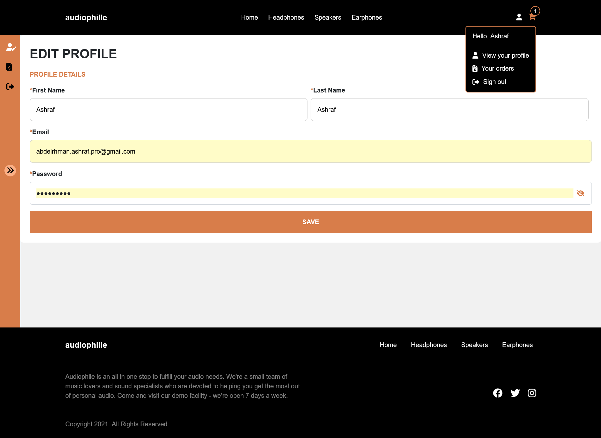
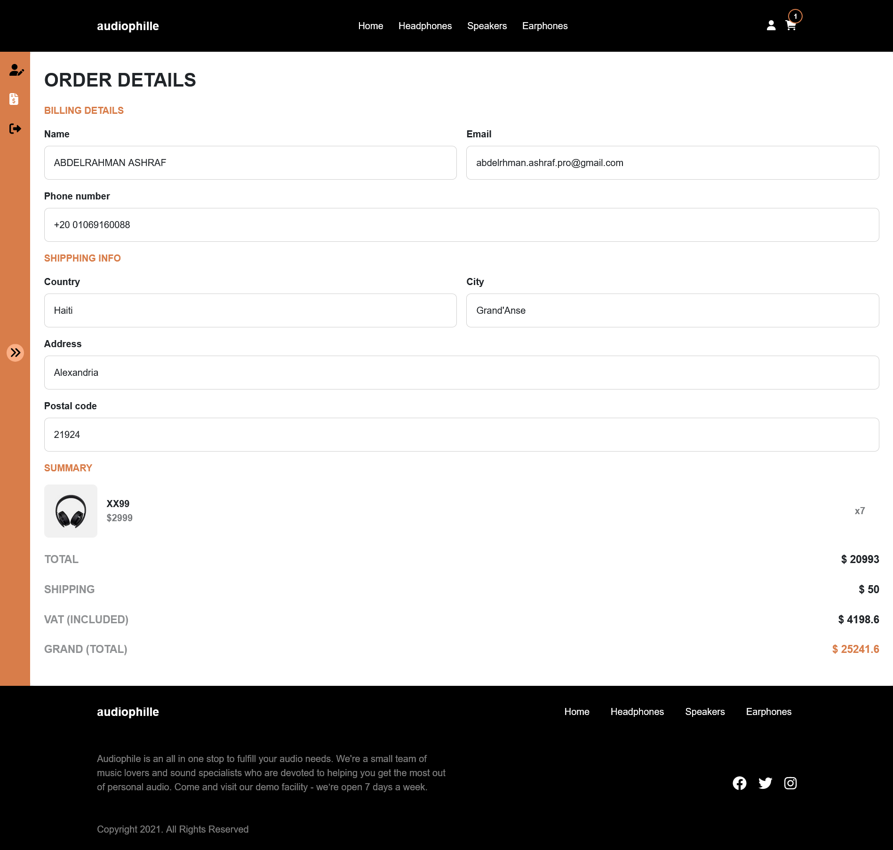
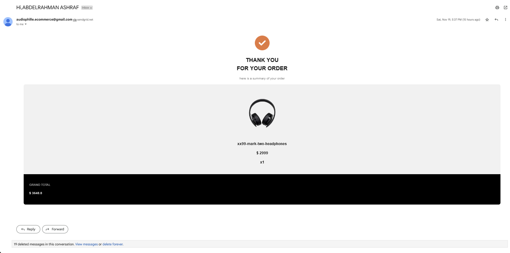

# Frontend Mentor - Audiophile e-commerce website solution

This is a solution to the [Audiophile e-commerce website challenge on Frontend Mentor](https://www.frontendmentor.io/challenges/audiophile-ecommerce-website-C8cuSd_wx). 

## Table of contents

- [Overview](#overview)
  - [Features](#Features)
  - [Screenshot](#screenshot)
  - [Links](#links)
- [My process](#my-process)
  - [Built with](#built-with)
  - [What I learned](#what-i-learned)
  - [Continued development](#continued-development)
  - [Useful resources](#useful-resources)
- [Author](#author)
- [Acknowledgments](#acknowledgments)

**Note: Delete this note and update the table of contents based on what sections you keep.**

## Overview
  Audiophile is the premier store for high end headphones, earphones, speakers, and audio accessories.
  

### Features

Users should be able to:

- Sign up / sign in to their account
- Edit their profile  (name,Email,password)
- See last submitted orders' details
- Receive an E-mail confirmation after submitting order
- See interactive loding screens and spinners during loading pages
- Purchase the order with cash or credit card
- View the optimal layout for the app depending on their device's screen size
- See hover states for all interactive elements on the page
- Add/Remove products from the cart
- Edit product quantities in the cart
- Fill in all fields in the checkout
- Receive strong form validations if fields are missed or incorrect during checkout
- See correct checkout totals depending on the products in the cart
  - Shipping always adds $50 to the order
  - VAT is calculated as 20% of the product total, excluding shipping
- See an order confirmation modal after checking out with an order summary
- See an alert modal after unsuccessful payment (only on credit card option)
- See an alert modal if they navigate away during form submission 

### Screenshot

#### Home

#### Headphones

#### Speakers

#### Earphones

#### Product Details

#### Checkout Form

#### Dashboard


#### Modals and pop ups alert


#### Received E-mail


**Note: Delete this note and the paragraphs above when you add your screenshot. If you prefer not to add a screenshot, feel free to remove this entire section.**

### Links

IMPORTANT:

  Since this project is one of my biggest projects and took a lot of time and efforts for testing and development,I decided to keep the source code private.
  If you are a reqruiter or a software agency that I applied to,feel free to ask me for the access to the source via any of my contacts.

  Thank you for understanding.

- Solution URL: (https://github.com/Abdelrhman-1998/About-Audiophile-E-commerce)
- Live Site URL:(https://audiophille-e-commerece.firebaseapp.com/)


### Used Technologies and libraries
- [Angular2(v.14)] 
- [Typescript]
- [Nodejs]
- [SASS]
- [Bootstrap(v.5)]
- [Fontawesome]
- [Firebase-Auth]
- [Firebase-RealtimeDatabase]
- [ClassValidators] -strong async validators that can be used to check phone number for   each country,email,zipCode,etc...
- [ngSkelton]() -used for lazy loading


**Note: These are just examples. Delete this note and replace the list above with your own choices**

### What I learned

Use this section to recap over some of your major learnings while working through this project. Writing these out and providing code samples of areas you want to highlight is a great way to reinforce your own knowledge.

To see how you can add code snippets, see below:

```html
<h1>Some HTML code I'm proud of</h1>
```
```css
.proud-of-this-css {
  color: papayawhip;
}
```
```js
const proudOfThisFunc = () => {
  console.log('🎉')
}
```

If you want more help with writing markdown, we'd recommend checking out [The Markdown Guide](https://www.markdownguide.org/) to learn more.

**Note: Delete this note and the content within this section and replace with your own learnings.**

### Continued development

Use this section to outline areas that you want to continue focusing on in future projects. These could be concepts you're still not completely comfortable with or techniques you found useful that you want to refine and perfect.

**Note: Delete this note and the content within this section and replace with your own plans for continued development.**

### Useful resources

- [Example resource 1](https://www.example.com) - This helped me for XYZ reason. I really liked this pattern and will use it going forward.
- [Example resource 2](https://www.example.com) - This is an amazing article which helped me finally understand XYZ. I'd recommend it to anyone still learning this concept.

**Note: Delete this note and replace the list above with resources that helped you during the challenge. These could come in handy for anyone viewing your solution or for yourself when you look back on this project in the future.**

## Author

- Website - [Add your name here](https://www.your-site.com)
- Frontend Mentor - [@yourusername](https://www.frontendmentor.io/profile/yourusername)
- Twitter - [@yourusername](https://www.twitter.com/yourusername)

**Note: Delete this note and add/remove/edit lines above based on what links you'd like to share.**

## Acknowledgments

This is where you can give a hat tip to anyone who helped you out on this project. Perhaps you worked in a team or got some inspiration from someone else's solution. This is the perfect place to give them some credit.

**Note: Delete this note and edit this section's content as necessary. If you completed this challenge by yourself, feel free to delete this section entirely.**
